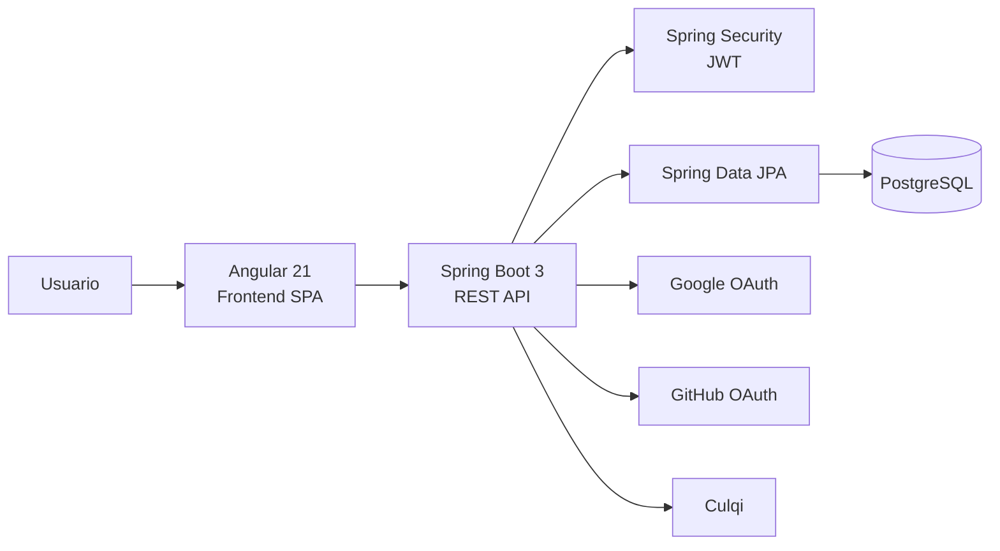
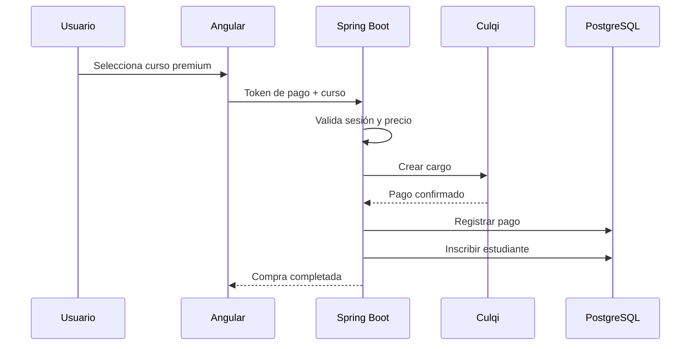

# 🎓 MasteryAcademy

> Plataforma e-learning Full Stack para gestión, comercialización y seguimiento de cursos online.

MasteryAcademy es un proyecto académico desarrollado con **Angular y Spring Boot** que implementa un ecosistema completo de aprendizaje digital.

La plataforma permite gestionar cursos, contenidos, instructores y estudiantes, ofreciendo inscripción a programas, reproducción de lecciones, evaluaciones, seguimiento de progreso, certificados, mensajería, gamificación y pagos online.

El sistema incorpora además autenticación tradicional y social mediante **Google y GitHub**, autorización mediante **Spring Security + JWT**, persistencia con **PostgreSQL** y un entorno completo preparado para ejecutarse mediante **Docker Compose**.

---

# 🚀 Funcionalidades principales

## 👨‍🎓 Estudiantes

- Registro e inicio de sesión.
- Inicio de sesión mediante Google.
- Inicio de sesión mediante GitHub.
- Exploración de cursos.
- Inscripción en programas.
- Compra de cursos premium.
- Reproductor de contenido.
- Seguimiento del progreso académico.
- Evaluaciones mediante quizzes.
- Emisión de certificados.
- Sistema de XP y niveles.
- Notificaciones.
- Mensajería con instructores.
- Perfil personal.
- Visualización del historial académico.

---

## 👨‍🏫 Instructores

- Creación de programas.
- Gestión de cursos.
- Gestión de módulos y lecciones.
- Publicación de contenido.
- Seguimiento de estudiantes.
- Comunicación con alumnos.
- Administración del contenido académico.

---

## 🛡️ Administradores

- Gestión de usuarios.
- Gestión global de cursos.
- Publicación y moderación de programas.
- Gestión de noticias.
- Supervisión de instructores y estudiantes.
- Visualización de métricas generales.
- Gestión de contenido de la plataforma.

---

# 🏗️ Arquitectura



El frontend consume una API REST desarrollada con Spring Boot.

La autenticación principal utiliza JWT y el backend mantiene una arquitectura organizada en controladores, servicios, repositorios y entidades.

---

# 💻 Stack tecnológico

## Frontend

- Angular 21
- TypeScript 5.9
- RxJS
- Angular Router
- Angular Forms
- Social Login
- HTML5
- CSS

## Backend

- Java 17
- Spring Boot 3.2
- Spring Web
- Spring Data JPA
- Spring Security
- JWT
- Bean Validation
- Springdoc OpenAPI
- Lombok

## Base de datos

- PostgreSQL 16
- Flyway
- JPA / Hibernate

## Integraciones

- Google OAuth
- GitHub OAuth
- Culqi

## Infraestructura

- Docker
- Docker Compose
- PostgreSQL
- pgAdmin

---

# 🔐 Seguridad

MasteryAcademy utiliza una arquitectura de autenticación **stateless** basada en JWT.

La implementación incluye:

- Spring Security.
- BCrypt para contraseñas.
- JWT Authentication Filter.
- Autorización de endpoints.
- Control de acceso según roles.
- CORS configurable.
- Validación de usuarios autenticados.
- Protección del contenido privado de los cursos.

Los principales roles del sistema son:

```text
STUDENT
INSTRUCTOR
ADMIN
```

---

# 🔑 Autenticación social

Además del registro tradicional, la plataforma permite autenticarse mediante proveedores externos.

## Google

El backend verifica los tokens emitidos por Google, crea el usuario cuando no existe y genera posteriormente un JWT propio de MasteryAcademy.

## GitHub

El sistema implementa el flujo OAuth de GitHub:

```text
Authorization Code
        ↓
GitHub Access Token
        ↓
Información del usuario
        ↓
Creación / actualización local
        ↓
JWT MasteryAcademy
```

Esto permite mantener un único sistema de autorización dentro de la plataforma independientemente del proveedor utilizado para iniciar sesión.

---

# 💳 Pagos mediante Culqi

MasteryAcademy incorpora integración con **Culqi** para el procesamiento de pagos de cursos premium.

El backend realiza validaciones antes de procesar la transacción:

- Verificación del usuario autenticado.
- Validación del correo asociado a la sesión.
- Prevención de compras duplicadas.
- Obtención segura del precio desde el backend.
- Creación del cargo mediante la API de Culqi.
- Registro del pago.
- Inscripción automática al curso después de una transacción exitosa.



---

# 📚 Gestión de cursos

Los cursos pueden contener diferentes elementos académicos:

```text
Curso
 └── Módulos
      └── Lecciones
```

La plataforma permite administrar:

- Categorías.
- Cursos.
- Módulos.
- Lecciones.
- Instructores.
- Estado de publicación.
- Nivel del curso.
- Precio.
- Progreso de estudiantes.

---

# 📈 Seguimiento de progreso

El sistema registra el avance del estudiante en los diferentes cursos.

Desde el dashboard puede visualizarse:

- Cursos inscritos.
- Porcentaje de progreso.
- Cursos completados.
- Nivel del estudiante.
- Experiencia acumulada.
- Certificaciones obtenidas.

---

# 📝 Evaluaciones

Los cursos pueden incorporar evaluaciones mediante quizzes.

Cada evaluación cuenta con:

- Preguntas.
- Opciones.
- Puntaje mínimo de aprobación.
- Resultado automático.
- Posibilidad de reintentar.

Cuando el estudiante cumple las condiciones definidas, puede obtener un certificado asociado al programa.

---

# 🏆 Gamificación

MasteryAcademy incorpora un sistema de gamificación basado en:

```text
XP
Niveles
Rangos
Logros
Notificaciones
```

Ejemplos de recompensas:

- Completar lecciones.
- Aprobar evaluaciones.
- Alcanzar nuevos niveles.

El sistema calcula automáticamente el nivel del estudiante según su experiencia acumulada.

---

# 💬 Mensajería y comunidad

La plataforma incorpora herramientas sociales y académicas:

- Mensajería entre estudiantes e instructores.
- Comentarios.
- Reseñas de cursos.
- Notificaciones.
- Gestión de noticias.

Esto permite complementar el contenido académico con interacción entre los usuarios.

---

# 📊 Simulador académico

MasteryAcademy incluye un módulo interactivo de simulación de trading utilizado como parte de la experiencia educativa.

El usuario puede trabajar con:

- Balance virtual.
- Posiciones simuladas.
- Activos.
- Ganancias y pérdidas virtuales.

La plataforma también incorpora un **asistente contextual de mentoría** que responde utilizando información del perfil académico y del simulador.

> El simulador utiliza datos y operaciones con fines educativos y no ejecuta operaciones financieras reales.

---

# 📡 API REST

El backend expone endpoints para diferentes módulos:

```text
Auth
Users
Courses
Categories
Content
Progress
Assessments
Payments
Reviews
Comments
Chat
Notifications
News
AI Copilot
```

La documentación de la API está disponible mediante **Springdoc OpenAPI / Swagger** durante el entorno de desarrollo.

---

# 🗄️ Persistencia

La aplicación utiliza PostgreSQL como motor principal.

La capa de persistencia está implementada con:

```text
Spring Data JPA
Hibernate
Flyway
PostgreSQL
```

Entre las principales entidades se encuentran:

- User
- Role
- Course
- Category
- CourseModule
- Lesson
- Quiz
- Question
- UserProgress
- Certificate
- Payment
- Review
- Comment
- ChatMessage
- Notification
- News

---

# 🐳 Ejecución mediante Docker

## Requisitos

- Docker
- Docker Compose
- Git

## 1. Clonar el repositorio

```bash
git clone https://github.com/MtrXisback/MasteryAcademy.git
cd MasteryAcademy
```

## 2. Crear variables de entorno

Utiliza el archivo incluido:

```text
.env.example
```

como referencia para crear:

```text
.env
```

Linux / macOS:

```bash
cp .env.example .env
```

Windows:

```powershell
copy .env.example .env
```

## 3. Configurar variables

Configura valores para:

```env
DB_USER=
DB_PASSWORD=
DB_NAME=

JWT_SECRET=

GOOGLE_CLIENT_ID=
GOOGLE_CLIENT_SECRET=

GITHUB_CLIENT_ID=
GITHUB_CLIENT_SECRET=

CULQI_PUBLIC_KEY=
CULQI_SECRET_KEY=

PGADMIN_EMAIL=
PGADMIN_PASSWORD=
```

> Nunca publiques credenciales reales ni secretos dentro del repositorio.

## 4. Levantar el entorno

```bash
docker compose up -d --build
```

Se iniciarán los principales servicios:

```text
Angular Frontend
Spring Boot API
PostgreSQL
pgAdmin
```

## 5. Verificar contenedores

```bash
docker compose ps
```

## 6. Detener la aplicación

```bash
docker compose down
```

---

# 📂 Estructura general

```text
MasteryAcademy/
│
├── frontend/
│   └── Angular
│
├── backend/
│   └── Spring Boot
│
├── docker-compose.yml
├── docker-compose.prod.yml
├── .env.example
└── README.md
```

Backend:

```text
backend/src/main/java/com/proyecto/cursos/
│
├── config/
├── controller/
├── exception/
├── model/
├── payload/
├── repository/
├── security/
└── service/
```

---

# 🎯 Objetivos técnicos

El proyecto fue desarrollado para aplicar conceptos de:

- Desarrollo Full Stack.
- Angular + Spring Boot.
- Diseño de APIs REST.
- Autenticación JWT.
- OAuth.
- Autorización basada en roles.
- Integración con APIs externas.
- Procesamiento de pagos.
- Arquitectura por capas.
- Persistencia con JPA.
- Migraciones de base de datos.
- Dockerización.
- Gestión de progreso académico.
- Gamificación.
- Manejo global de excepciones.

---

# 🔮 Posibles mejoras

La plataforma puede continuar evolucionando con:

- WebSockets para mensajería en tiempo real.
- Almacenamiento de videos mediante servicios Cloud.
- Redis para caching.
- Tests de integración adicionales.
- Observabilidad con Prometheus y Grafana.
- Pipeline CI/CD.
- Kubernetes.
- CDN para recursos multimedia.
- Integración con un proveedor LLM para el asistente académico.

---

# 🎓 Contexto

Proyecto académico desarrollado como parte de la formación en **Computación e Informática**.

MasteryAcademy fue diseñado como una plataforma integral para aplicar conceptos de frontend, backend, seguridad, bases de datos, pagos, autenticación externa e infraestructura dentro de un mismo sistema.

---

# 👨‍💻 Autor

**Miguel Alonso Villon Alcantara**

Desarrollador Full Stack Jr.

- GitHub: [@MtrXisback](https://github.com/MtrXisback)
